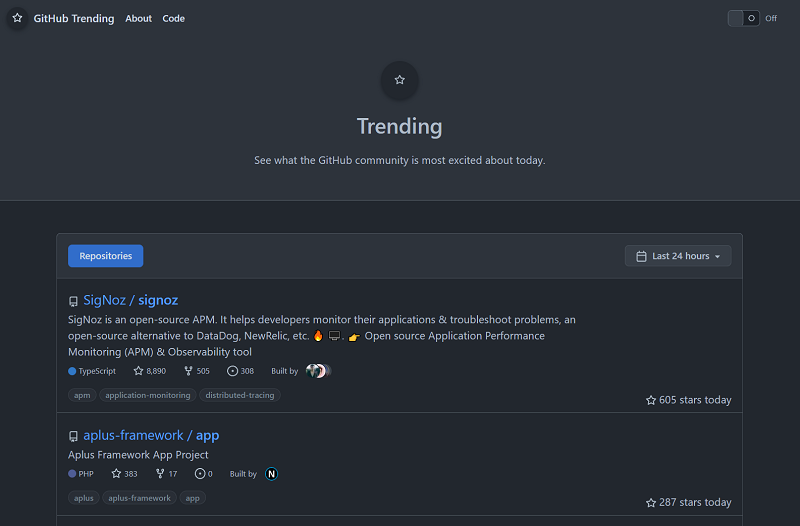

# ghtrending ⭐

[](https://github.com/GrantBirki/ghtrending/actions/workflows/ci.yml) [](https://github.com/GrantBirki/ghtrending/actions/workflows/stars.yml) [](https://github.com/GrantBirki/ghtrending/actions/workflows/stars_to_s3.yml)

---

⚠️ This project is being archived. It  appears that GitHub is keeping the trending page and that is great! I'm no longer going to maintain this project for the following reasons:

1. I don't want to keep paying $40 a year for the domain
2. I cannot move it under an existing domain easily (like one I already own) because Cloudflare charges $10 a month for subsub domain certificates
3. I simply don't have enough time.

---

Open source version of GitHub's trending page

Find the latest trending repositories on GitHub!

[ghtrending.birki.io link](https://ghtrending.birki.io) 🔗



> Please note, this project is not affiliated with GitHub, Inc.

## About 💡

On September 1st, 2022, GitHub [announced](https://github.com/community/community/discussions/31644#discussion-4354090) that it will be deprecating the `/trending` page. Many GitHub users (myself included) really enjoy the trending page. It is a great way to discover new repositories, projects, and developers.

This project is an attempt to recreate the trending page in a way that is open source and community driven. The goal is to be able to preserve a feed of trending repos that can be used by anyone, regardless of which direction GitHub chooses to go with the `/trending` page

### How it Works 🔨

This project has two main components:

- The **data**
- The **website**

#### The Data 📊

All data which is used to generate the trending data is from [gharchive](http://www.gharchive.org/) which is an open source project to collect a history of all GitHub events.

A GitHub Action cron runs once an hour to collect all data from the previous hour from gharchive and stores that data in an Azure Storage Table. The cron stores the timestamp of when the "star event" took place, the name of the repo, and the name of the user who starred the repo.

From here, the second phase of the Action workflow kicks off which aggregates all the events from the database in time slices (1 day, 1 week, and 1 month). This data is then enriched with repository and contributor information from GitHub's API.

Once we have enriched data, it is sent to an S3 bucket in JSON format and those files are served by Cloudflare's CDN all around the world

#### The Website 🌐

> Wow the website looks *just like GitHub*! Is it GitHub?

Even though the website looks very similar to GitHub, it is not GitHub at all! In fact, GitHub open sourced their entire CSS design system called [Primer](https://primer.style/). They have also been releasing React componets for Primer as well and that is exactly what this website is built with!

In short, this website is a React app that uses Primer components and the data from the data pipeline to generate the trending page.

## Contributing 🤝

All and any contributions are welcome! If you have an idea, open an issue. If you want to contribute code, open a PR!

### Development Setup 🔨

To get started, all you will need is `node` and `npm` installed to start the React app locally:

```bash
npm i
npm run prebuild
npm run start
```

A local instance of the website will be running at [`localhost:3000`](http://localhost:3000)

---

It should be noted that I have not included instructions on how to contribute to the "data/backend" portion of this project. That is because it is mostly a "set-and-forget" situation. The GitHub Action cron(s) will always run in the background and Azure Table Storage will just *exist*. There really shouldn't ever be a reason to modify the data pipeline ™️

However, if you are interested in contributing to the data pipeline, please open an issue and I will be happy to help you get started!

## Open Source ❤️

This project is open source and is licensed under the [MIT License](LICENSE). The goal of this project was to only use open source components and make it run as cheap as possible. The only paid component of this project to date is the domain name.
